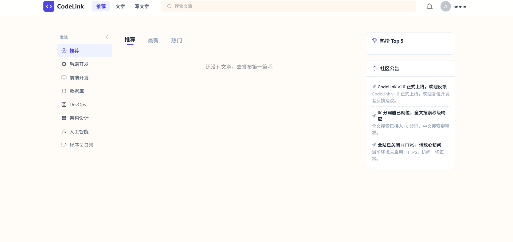
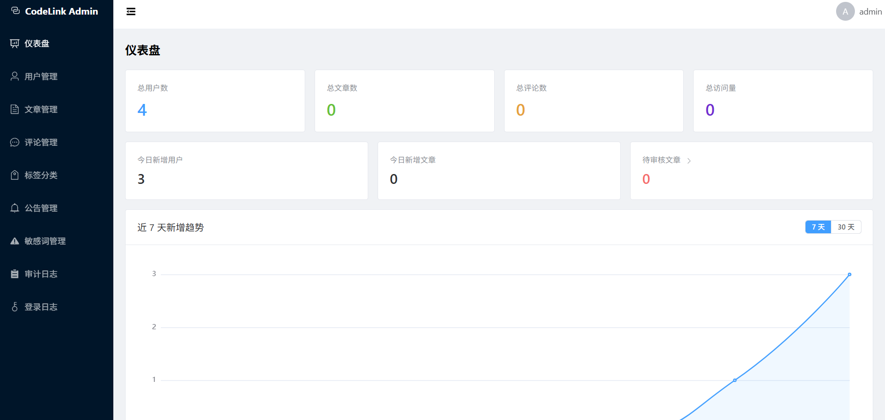

# CodeLink 技术社区

一个前后端分离的技术社区项目，包含用户端和管理后台两部分。用户可以注册登录、写文章、评论、点赞收藏、按关键词搜索；管理员可以管理文章、用户、分类标签、敏感词和公告。

后端是模块化单体，一个 Maven 工程切出 5 个业务模块和 2 个启动模块，用户端 API 和后台 API 各自独立启动、独立端口。

## 技术栈

**后端**

| 项 | 选型 |
| --- | --- |
| 语言 / 运行时 | Java 21 |
| 框架 | Spring Boot 3.4.1 |
| 持久层 | MyBatis-Plus 3.5.7 |
| 认证授权 | Spring Security + JWT（jjwt 0.12.6） |
| 构建 | Maven 多模块 |

**前端**

| 项 | 选型 |
| --- | --- |
| 框架 | Vue 3.5 + TypeScript 5.6 |
| 构建 | Vite 5.4 |
| UI | Element Plus 2.9 |
| 状态 / 路由 | Pinia + Vue Router 4 |
| 其他 | md-editor-v3（用户端 Markdown 编辑器）、ECharts 5（后台统计图表）、Axios |

**中间件**

| 项 | 版本 | 用途 |
| --- | --- | --- |
| MySQL | 8.4 | 用户、文章、评论、分类标签等主数据 |
| Redis | 8.2 | 文章详情与热榜缓存、搜索热词、登出 token 黑名单 |
| MongoDB | 8.0 | 文章草稿、用户动态、操作日志、评论读副本（MySQL 的读侧投影） |
| Elasticsearch | 9.5.2 + IK 9.5.0 | 文章全文检索（中文分词） |
| RabbitMQ | 4.3.5 | 文章索引同步、评论副本同步、用户事件、图片异步删除 |

## 项目结构

```
CodeLink-coding/
├── codeknest-backend/                 后端（Maven 多模块）
│   ├── pom.xml                            聚合父 POM，统一依赖版本
│   ├── codeknest-common/                  公共层：统一返回与异常、Security+JWT、
│   │                                      MyBatis-Plus 配置、Redis 配置、部署自举
│   ├── codeknest-module-account/          账号域：认证、用户、消息通知
│   ├── codeknest-module-content/          内容域：文章、评论、互动
│   ├── codeknest-module-search/           搜索域：ES 检索、搜索热词
│   ├── codeknest-module-admin/            后台管理域
│   ├── codeknest-server-web/              用户端 API 启动模块（:8080）
│   ├── codeknest-server-admin/            后台 API 启动模块（:8081）
│   └── run-sql.ps1                        开发期 SQL 执行小工具
├── codeknest-web/                     用户端前端（:5173）
├── codeknest-admin/                   管理后台前端（:5174）
├── scripts/
│   └── init.sql                           重置脚本（仅删库，重启应用自动重建）
├── .env.example                       环境变量模板
├── data/                              运行时数据（上传文件、自动生成的 JWT 密钥，不入库）
├── image/                             图片存储目录（运行时生成，不入库）
└── LICENSE
```

模块依赖方向是单向的：`content → account`、`search → content`、`admin → content + account`；`server-web` 不依赖 admin 模块，`server-admin` 不依赖 search 模块。

## 环境要求

- JDK 21
- Maven 3.9 及以上
- Node.js 18 及以上
- MySQL 8.4、Redis 8.2、MongoDB 8.0、Elasticsearch 9.5.2、RabbitMQ 4.3.5

其中两处需要额外注意：

- **Elasticsearch 需要装 IK 中文分词插件**，版本要和 ES 一致（本项目用 9.5.0），装完重启 ES。
- **RabbitMQ 需要一个名为 `/CodeLink` 的 vhost**，默认 vhost `/` 不行。也可以改 `.env` 里的 `RABBITMQ_VHOST` 换成已有 vhost。

## 本地部署

### 1. 启动中间件

按上表把五个中间件跑起来即可。MySQL、Redis、MongoDB、RabbitMQ 用默认配置就行，ES 记得装 IK 插件。

中间件放在别的机器上也可以，下一步在 `.env` 里填对应的地址。

### 2. 配置环境变量

把根目录的 `.env.example` 复制成 `.env`，填上真实值：

```bash
cp .env.example .env
```

`.env` 里的变量分两类：

- 寻址类（`*_HOST`、`*_PORT`、`*_URI`）：有默认值，中间件跑在本机时不用改
- 凭据类（`*_USER`、`*_PWD`）：必须填。这些值由中间件决定——密码得跟 MySQL / Redis 里建好的账号一致，应用没法替你生成

`JWT_SECRET` 是个例外，留空也能跑。JWT 是对称签名，密钥由项目自己签、自己验，值本身没有外部约束。首次启动时会自动生成一个 48 字节随机密钥写进 `data/.jwt-secret`，之后每次启动都复用——所以重启不会让已登录用户掉线，用户端和后台两个服务也用同一把密钥。

要显式指定的话（生产环境建议这样），填至少 32 个字符（256 位），太短会直接启动失败；可以用 `openssl rand -base64 48` 生成。多机部署时各机密钥必须一致，要么显式配置 `JWT_SECRET`，要么把 `JWT_SECRET_FILE` 指向共享卷。

`.env` 已被 `.gitignore` 排除，不会提交。

### 3. 启动后端

```bash
cd codeknest-backend
mvn -DskipTests clean install
```

构建完成后分别启动两个服务（注意在 `codeknest-backend` 目录下执行，否则图片会存到别的目录）：

```bash
java -jar codeknest-server-web/target/codeknest-server-web.jar
java -jar codeknest-server-admin/target/codeknest-server-admin.jar
```

**数据库不用手工建。** 应用启动时会自己检查：库不存在就建库，表不存在就建表，默认分类标签角色公告缺失就补上，MongoDB 的集合索引也会自动创建。这套逻辑是幂等的，已经存在的东西不会动，也不会覆盖你改过的数据。所以第一次启动前你只需要保证 MySQL 可连接、`.env` 里的账号有建库权限。

重复执行启动命令也没关系：日志里会明确打印这次是「已存在，跳过创建」还是「不存在，正在创建」；JWT 密钥同样会说明是「复用本地密钥文件」还是「已自动生成并写入 ./data/.jwt-secret」。

需要彻底重置数据库时，执行 `scripts/init.sql` 删库（或手动 `DROP DATABASE codeknest`），再重启应用即可重建。

### 4. 启动前端

用户端：

```bash
cd codeknest-web
npm install
npm run dev
```

管理后台：

```bash
cd codeknest-admin
npm install
npm run dev
```

两个前端都通过 Vite 代理把 `/api` 转发到后端，用户端转发到 `:8080`，后台转发到 `:8081`。如果后端不在本机，启动前设置 `VITE_PROXY_TARGET` 指向实际地址。

### 5. 访问

| 服务 | 地址 |
| --- | --- |
| 用户端 | http://localhost:5173 |
| 管理后台 | http://localhost:5174 |
| 用户端 API | http://localhost:8080/api |
| 后台 API | http://localhost:8081/api |

开发环境内置了一个管理员账号：`admin` / `admin`，可以直接登录管理后台。这个账号只在开发环境使用，正式部署前请改掉密码。

## 项目演示

**用户端首页**



**后台系统**

